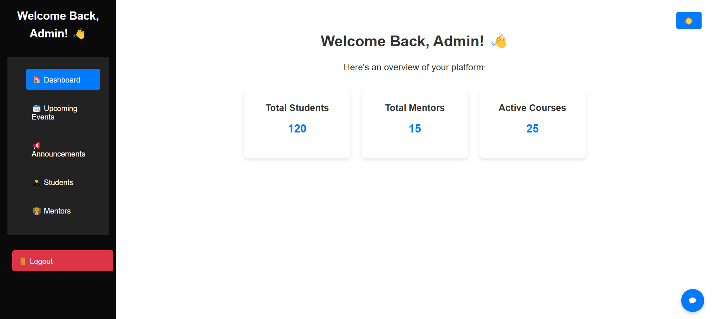
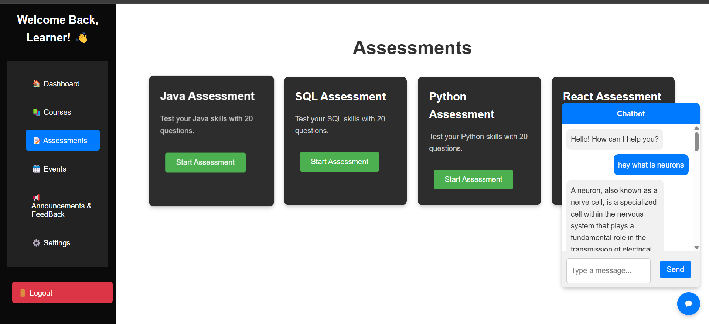
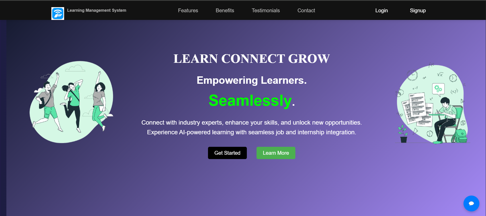

# 🎓 LMS Platform - Full Stack Learning Management System

Welcome to the **LMS Platform**, a powerful and feature-rich full-stack Learning Management System designed to streamline and enhance the educational experience for students, mentors, and administrators. This platform provides **three distinct dashboards** tailored to each user role:

- ✅ **Student Dashboard**
- 🧑‍🏫 **Mentor Dashboard**
- 🛠️ **Admin Dashboard**

---

## 🚀 Features

### 👨‍🎓 Student Dashboard
- 📚 Browse and enroll in courses
- 📈 Track course progress with visual charts
- 🧠 Access course materials and assignments
- 🗓️ View personalized learning calendar
- 💬 Participate in discussions and Q&A

### 👨‍🏫 Mentor Dashboard
- ✍️ Create and manage course content
- 📝 Review student submissions
- 📊 Monitor student performance and engagement
- 📢 Send announcements and schedule sessions

### 🛠️ Admin Dashboard
- 🔐 Manage users and roles (Students, Mentors)
- 📁 Approve and monitor courses
- 📉 View platform analytics and usage reports
- 🧾 Control content visibility and system settings

---

## 🛠️ Tech Stack

### 🔷 Frontend
- **React.js** (with functional components & hooks)
- **Tailwind CSS** for sleek, responsive design
- **Framer Motion** for smooth animations
- **Axios** for API calls
- **React Router** for routing and navigation

### 🔶 Backend
- **Node.js + Express.js** for building RESTful APIs
- **MongoDB + Mongoose** for database management
- **JWT Authentication** for secure login/signup
- **Multer** for file uploads (course materials, profile pics)

---

## 📂 Project Structure
lms-platform/
│
├── backend/
│   ├── controllers/         # Backend logic and controller functions
│   ├── middleware/          # Custom middleware (e.g., auth, error handling)
│   ├── model/               # Mongoose models (User, Course, etc.)
│   ├── routes/              # Express routes for API endpoints
│   ├── node_modules/        # Backend dependencies
│   ├── .env                 # Environment variables for backend
│   ├── .gitignore
│   ├── index.js             # Entry point for the server
│   ├── package.json
│   ├── package-lock.json
│   └── seed.js              # Optional: Database seeding script
│
├── client/
│   ├── node_modules/        # Frontend dependencies
│   ├── public/              # Static assets (index.html, icons, etc.)
│   └── src/
│       ├── assets/          # Images, icons, static resources
│       ├── components/      # Reusable React components
│       ├── context/         # Global context (AuthContext, etc.)
│       ├── landingpage/     # Components specific to the landing page
│       ├── pages/           # Role-specific pages (Student, Admin, Mentor)
│       ├── styles/          # CSS and styling files
│       ├── App.jsx          # Root component
│       ├── App.css
│       ├── index.jsx        # Main React DOM render
│       ├── index.css
│       └── main.jsx         # Possibly entry or routing hub
│
├── .gitignore
├── eslint.config.js         # Linting configuration
├── package.json             # Project-level dependencies (if combined setup)
├── package-lock.json

## 🖥️ LMS Platform - Dashboard Previews

### 👨‍🏫 Mentor Dashboard

### 🛠️ Admin Dashboard

### 🤖 LMS Chatbot

### 🎯 LMS Landing Page

### 👨‍🎓 Learner Dashboard

